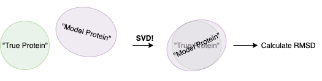
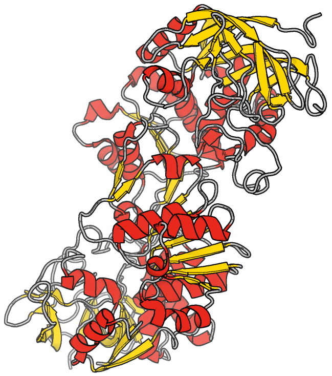
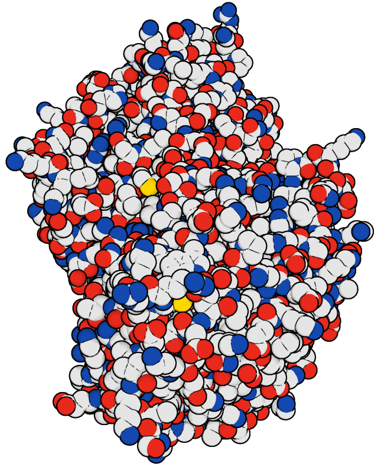
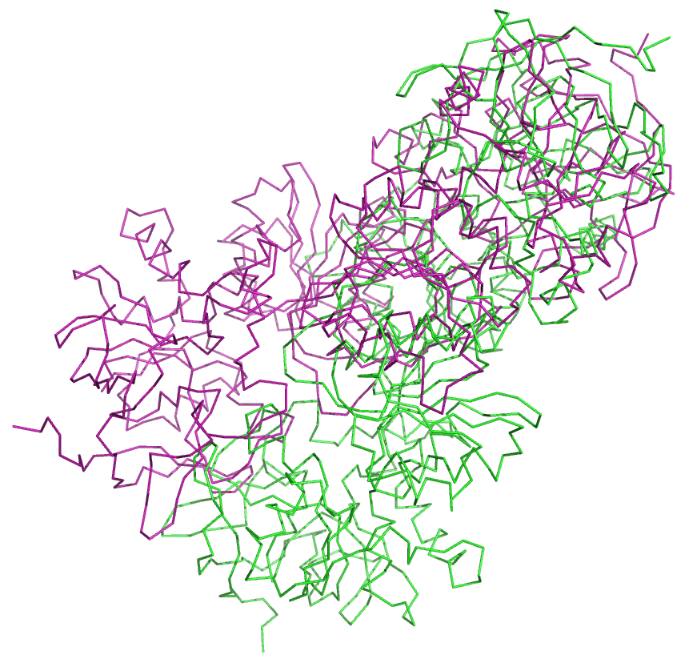
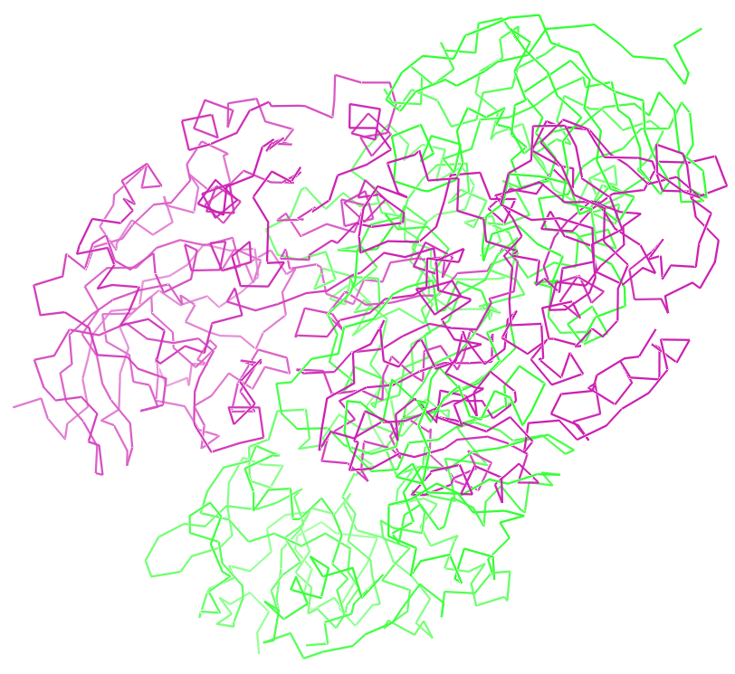
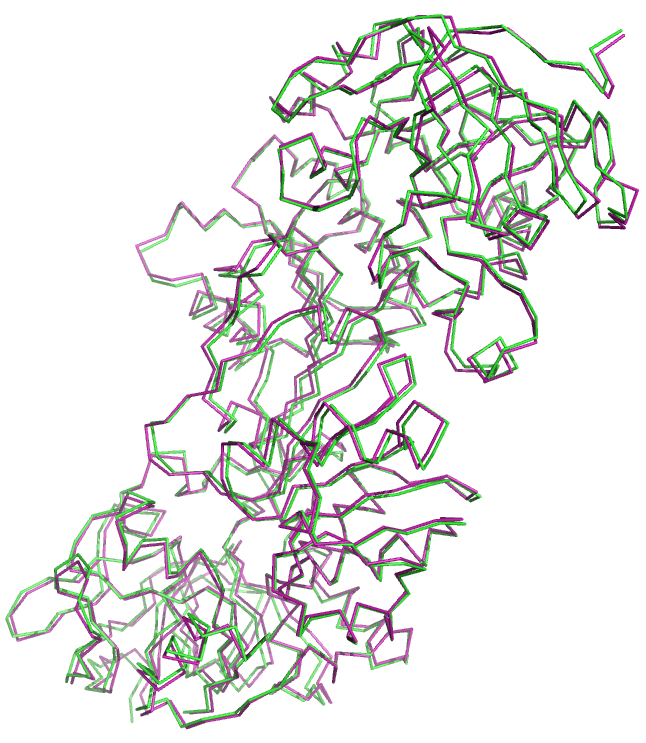
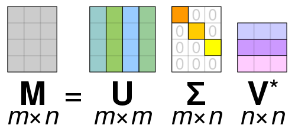

# Calculate RMSD using SVD

During my PhD and postdoc, my main day-to-day was driven by one question: 

>How do we make the best model protein structures? 

To answer that question, this is often done by calculating the root-mean square deviation (RMSD) between the predicted structure vs. the known 'true' protein structure. There are other measures (e.g. TM-score, GDT_TS), but RMSD is still the most intuitive, and (unfortunately?) the accepted standard metric for goodness-of-fit.
* RMSD has some flaws; for example, it suffers from [size-dependent effects](https://www.ncbi.nlm.nih.gov/pmc/articles/PMC4321859/), but we will discuss this another time.

**If you have less than 3 minutes**
* Singular-value decomposition (SVD) allows us to find the optimal _rotation_ and _translation_ matrices that best aligns the predicted structure to the true protein structure. Following alignment, it's a case of just computing
$$RMSD = \sqrt{\dfrac{1}{n} \sum_{i=1}^{n} d_i}$$ 
where 
$$d_i = (x_{i,nat}-x_{i, model})^2 + (y_{i,nat}-y_{i, model})^2 + (z_{i,nat}-z_{i, model})^2$$



**If you have about 10 minutes**
* Read on.

### A very short primer on protein structure data - feel free to skip if you know what protein structures are like!

The Protein Data Bank (PDB) is _the_ central repository that contains protein structure data. The data is gathered from scientists from around the world who determine the structure of a protein through experimental methods (typically X-ray crystallography, but the trend is going toward cryo electron microscopy; cryo-EM). One thing to bear in mind is that every structure that we have, even though it's experimental data, is in fact (yet another) a model! 

Condensing lots of physics and theory here, but in the case of X-ray crystallography, it largely has to do with the fact that the method detects and "sees" _electron diffraction_. It doesn't see proteins as fancy helices or loops;

<div>
    
</div>

Thus, to resolve from an electron diffraction to signals that can be used as atomic coordinates, lots of physics and maths are involved. Essentially, the final structure we obtain is a _model of the electron density data_.

Protein structures are then represented in an unusual 80-character format (historical reasons) that contain:
* Information about a protein's sequence
* Information about the amino acids that make up the protein, and _most importantly for this exercise_,
* The coordinates of each **atom** in the protein.

The coordinates are in 3-dimensional $(x,y,z)$ space, and represented by an $N \times 3$ matrix:

```
[ 16.54 ,  10.798, -30.122],
[ 16.677,  12.283, -30.154],
[ 16.876,  12.799, -28.737],
...,
[ -7.62 ,  -7.475,  -5.355],
[-11.083,   2.95 ,  -9.974],
[-10.271,   2.053, -12.363]
```

leading to a structure like this:

<div>
    
</div>

## RMSD - the maths
Given two protein structures with $n$ atoms, the RMSD between the two can be calulated by:
$$RMSD = \sqrt{\dfrac{1}{n} \sum_{i=1}^{n} () }$$
where
$$d_i = (x_{i,nat}-x_{i, model})^2 + (y_{i,nat}-y_{i, model})^2 + (z_{i,nat}-z_{i, model})^2$$

So what does this mean? We iterate across $n$ aligned (this will be explained later) atoms, and take the difference in their x-, y-, and z-coordinates. We then take the square root of the average deviation. This metric can be custom fit to either calculate across _all_ atoms of two protein structures, or a subset - so long as $n$ is identical between the predicted and true structures.

### Align structures _before_ calculating RMSD!

Before we calculate the RMSD, we need to `align` our structures for two reasons:
* PDB structures are typically situated in different starting coordinates of Euclidean space.
* There can be small differences in length between the true and predicted structures, and/or it may be relevant to measure the RMSD across a comparable region.

However, _how_ do we align two protein structures? Structural alignment can be done with many variations; the green structure is the "true" answer and the purple one is the prediction.
<div>
    
    
    
</div>

Intuitively, we can see that the third alignment is the "correct" one - it maximises the 'fit' between the green and purple structures. This is the alignment that **minimises the RMSD**, and this alignment is obtained by singular value decomposition (SVD). In fact, for the purposes of calculating RMSD for model prediction, we often find this optimal alignment first, _then_ measure the RMSD.

Computationally, the simplest way to align two structures is to use BioPython. When we align structures, it's good practice to be mindful of the following:
* There should be a way to align the sequences of two structures. This does **not** mean that there has to be an _exact amino acid sequence match_ between the native structure and the predicted structure. However, a mechanism to compare them should be considered. Simply using residue numbers doesn't always work, either! (but this is for another time)
* We can align one part of the structure to then measure the RMSD of another. This is particularly useful when we want to measure the RMSD of a very specific subsequence when the remaining bits of the protein structure are almost invariant.

## Calculating RMSD using BioPython
We will assume, for sake of argument, that the _alpha_ alcohol dehydrogenase (PDB: 1hso) is the "true" structure and the _gamma_ alcohol dehydrogenase (PDB: 1ht0) is the "model" structure.


```python
# This makes life so much easier.
from Bio.PDB.PDBParser import PDBParser
from Bio.SVDSuperimposer import SVDSuperimposer
import numpy as np
```


```python
# Let's get our two structures; call them native (true) and model 
p = PDBParser(QUIET=True)
native = p.get_structure("native", "1hso.pdb")
model  = p.get_structure("model", "1ht0.pdb")
```

Protein structures contain the following:
* Chains (these are typically codified with a letter)
* Residues (these are almost always numbered)
* Atoms

A protein structure object from the PDB parser allows us to grab each; e.g., to get the set of residues in chain A of the protein,
```
chain_a = native[0]['A']
residues_a = [ r for r in chain_a ]
```

(For the eagle-eyed of you, you would have noticed a `0` indexing above. That's because the `Structure` object from the BioPython PDBParser also adds another layer, called the `Model` layer (**not** to be confused with "model structure" as we have mentioned previously))


```python
from Bio.PDB.Polypeptide import three_to_one
from Bio.SVDSuperimposer import SVDSuperimposer
from Bio.PDB.Structure import Structure

AA = ["ALA", "CYS", "ASP", "GLU", "PHE", "GLY", "HIS", "ILE", "LYS", "LEU", "MET", "ASN", "PRO", "GLN",
      "ARG", "SER", "THR", "VAL", "TRP", "TYR"]

# Type functions because it's helpful.
def align(native: Structure, model: Structure, atom_types = ["CA", "N", "C", "O"]) -> SVDSuperimposer:
    """
    Aligns a model structure onto a native structure
    Using the atom types listed in `atom_types`.
    """
    
    # A long one-liner that gets the one-letter amino acid representation for each residue in a structure,
    # then joins those letters into one long string.
    native_seq = "".join([ three_to_one(r.resname) for r in native[0].get_residues() if r.resname in AA ])
    model_seq = "".join([ three_to_one(r.resname) for r in model[0].get_residues() if r.resname in AA ])

    ## Some assertions that can be used
    # assert model_seq in native_seq, "There should be an alignable sequence."
    assert len(model_seq) == len(native_seq), "The sequences should be of identical length."
    
    # Get the coordinates of the Atom object if the Atom is from an amino acid residue,
    # and the atom type is what's specified in atom_types.
    # Traditionally RMSD is calculated for either:
    # Only the alpha-carbon atoms (CA), or
    # The "protein backbone" atoms (CA, N, C, O), or
    # All atoms
    native_coords = [ a.coord for a in native[0].get_atoms() if a.parent.resname in AA and a.name in atom_types ]
    model_coords = [ a.coord for a in model[0].get_atoms() if a.parent.resname in AA and a.name in atom_types ]
    
    si = SVDSuperimposer()
    si.set(np.array(native_coords), np.array(model_coords))
    si.run() # Run the SVD alignment
    
    return si
```


```python
si = align(native, model)
print("Initial RMSD: {:.2f} angstroms; full-backbone RMSD after alignment: {:.2f} angstroms".format(si.get_init_rms(), si.get_rms()))
```

    Initial RMSD: 35.26 angstroms; full-backbone RMSD after alignment: 0.84 angstroms


We can see above that aligning two protein structures prior to calculating the RMSD can have a huge effect on the RMSD value. For some, this might seem like a bit of a cheat: we aligned the structure to _minimise_ RMSD, so obviously this is bound to happen! 

While that's true, we have to account for the fact that protein structures are often not standardised to a specific region of the coordinate space, and so this is a necessary process to avoid over-penalisation. Furthermore, it's always possible to align one region of a protein to then measure the RMSD of another region. This is an approach that was used by the [Antibody modelling assessment (AMA)](https://www.ncbi.nlm.nih.gov/pubmed/24668560) to calculate the RMSD of specific loops of antibodies.

In fact, we can do something broadly similar; we can _align_ using half of the atoms, but then calculate the RMSD of the full protein:


```python
def rmsd(native_coords, model_coords, rot, tran):
    model_coords_rotated = np.dot(model_coords, rot) + tran
    diff = native_coords - model_coords_rotated
    RMSD = np.sqrt(sum(sum(diff**2))/native_coords.shape[0])
    return RMSD

def specific_align(native: Structure, model: Structure, 
          aln_atoms = 0.5,
          atom_types = ["CA", "N", "C", "O"]) -> list:
    
    # A long one-liner that gets the one-letter amino acid representation for each residue in a structure,
    # then joins those letters into one long string.
    native_seq = "".join([ three_to_one(r.resname) for r in native[0].get_residues() if r.resname in AA ])
    model_seq = "".join([ three_to_one(r.resname) for r in model[0].get_residues() if r.resname in AA ])
    
    assert len(model_seq) == len(native_seq), "The sequences should be of identical length."
    
    # Get the atoms that we want to align
    native_coords = [ a.coord for a in native[0].get_atoms() if a.parent.resname in AA and a.name in atom_types ]
    model_coords = [ a.coord for a in model[0].get_atoms() if a.parent.resname in AA and a.name in atom_types ]

    # Convert to numpy arrays
    native_coords = np.array(native_coords)
    model_coords = np.array(model_coords)
    
    # Use a specific percentage of atoms to align.
    percentage_to_aln = int(aln_atoms * len(native_coords))
    
    si = SVDSuperimposer()
    si.set(native_coords[:percentage_to_aln], model_coords[:percentage_to_aln])
    si.run()
    
    # The SVD superimposer above gives us the rotation and translation matrices
    # that we can use to "transform" the model coordinates. The rotation and translation
    # matrices were based on aligning 50% of the backbone atoms. I will explain this a bit more later.
    RMSD = rmsd(native_coords, model_coords, si.rot, si.tran)
    
    return [si, RMSD]
```


```python
si_specific, rmsd_bb = specific_align(native, model)
print("The initial RMSD is {:.2f}, with a 50% aligned backbone RMSD of {:.2f} and a full backbone RMSD of {:.2f}".format(
    si_specific.get_init_rms(), si_specific.get_rms(), rmsd_bb))
```

    The initial RMSD is 30.11, with a 50% aligned backbone RMSD of 0.40 and a full backbone RMSD of 1.47


So there are a couple of observations to be made here:
* The initial and 50%-aligned RMSD values are lower, but these are _not_ comparable to the previous experiment. This is because we were calculating the distance over 50% of the backbone atoms, rather than the complete set. Essentially, the previous experiment is more likely to have a higher RMSD because there can be more anomalous atom coordinates that throw off the RMSD value.
* The full backbone RMSD is what's comparable to the previous experiment. The difference is an RMSD of 0.84A when we align _all_ backbone atoms vs. 1.47A for when we align _half_ of the backbone atoms, but **still** calculate the distance across all backbone atoms. We can thus see that the alignment can have a huge impact on the reported RMSD.

The magical element in all of this is the **SVD**. If you want to stop here, the above code is a basic way to calculate RMSD using BioPython. Otherwise, continue!

## Manually Calculating RMSD / What on earth is SVD?



Essentially, it decomposes a $m\times n$ matrix $M$ into three matrices:
* A $m \times n$ matrix $\Sigma$ whose diagonal contains the _square-root of the eigenvalue_ of $\mathbf{MM^{*}}$
* A $m\times m$ matrix _U_ whose columns are the eigenvectors of $\mathbf{MM^{*}}$
* A $n\times n$ matrix _V*_ whose columns are the eigenvectors of $\mathbf{M^{*}M}$

I won't go into the details of _how_ SVD is run (outside the scope of this post).

Remember from a [previous post]("") that a vector $v$ is an **eigenvector** if it satisfies $Mv = \lambda v$, i.e., $v$ only changes by a scalar factor $\lambda$ when it is transformed by $M$. In practice, this means that $v$ captures the _direction_ of the transformation of $M$.

In the context of the work here, we use SVD to find the rotation and translation matrices that aligns the model protein structure onto the native one.

For ease of notation, the set of $n \times 3$ coordinates from the model structure will be known as $P$ while the set of $n \times 3$ coordinates from the native structure will be denoted as $Q$.

The entire procedure for aligning protein structures using SVD is as follows:
1. "Centre" the structures by the centroids $C_P$ and $C_Q$: $P_m = P-C_P$ and $Q_m = Q-C_Q$
2. Obtain the covariance matrix $W = Q_m^TP_m$
3. Run SVD on $W$ to obtain $U, \Sigma, V^*$
4. Compute the (possible) rotation matrix $R = (VU^T)$.
> If the determinant of $R$ is negative, then flip the sign of $V_z$ to keep it in the right-hand coordinate system; otherwise, we're good.
5. The translation matrix $T = C_Q - C_PR$.


```python
# Function to get rotation and translation matrices
def get_rot_tran(coord_true, coord_pred):
    """
    Given two matrices, return a rotation and translation matrix
    
    """
    centroid_pred = np.sum(coord_pred, axis=0) / coord_pred.shape[0]
    centroid_true = np.sum(coord_true, axis=0) / coord_true.shape[0]
    
    p_prime = coord_pred - centroid_pred
    q_prime = coord_true - centroid_true
    
    W = np.dot(q_prime.T, p_prime)
    U, S, Vt = np.linalg.svd(W)
    
    V = Vt.T
    
    rot = np.dot(V, U.T)
    det = np.linalg.det(rot)
    
    # The determinant is needed to detect whether we need a right-hand coordinate system or not
    # This basically means we just have to flip the Z-axis
    if det < 0:
        Vt[2] = -Vt[2]
        V = Vt.T
        rot = np.dot(V, U.T)
        
    tran = centroid_true - np.dot(centroid_pred, rot)
    return rot, tran

def get_specific_atoms(structure, atom_types = ["CA", "N", "C", "O"]):
    """
    Get atom coordinates of a Structure object for specified atom types
    """
    return np.array([a.coord for a in structure.get_atoms() if a.parent.resname in AA and a.name in atom_types ])
```


```python
# Let's run this and compare with the BioPython superimposer
native_backbone = get_specific_atoms(native)
model_backbone  = get_specific_atoms(model)

rot, tran = get_rot_tran(native_backbone, model_backbone)
si = SVDSuperimposer()
si.set(native_backbone, model_backbone)
si.run()
```

Once we have the rotation and translation matrices, the calculation of RMSD is then:


```python
rmsd(native_backbone, model_backbone, rot, tran)
```


    0.836309515402226


```python
si.get_rms()
```


    0.836309515402226


Voila!
